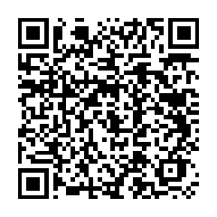

# Visual novel about a school
# Attention!
- It is in early early Alpha right now.
- I am bad at coding, so you may vomit while looking at my code :)
 
 

My 2nd try with ren'py. I try to make a game about a school or so idk

Its in very very early developement and i really appreciate ideas or even Pull requests.

I am very shitty in drawing so there are NO real images right now, there are currently only placeholders. But real pictures will hopefully come soon...

   

This game is a tiny bit inspired by doki doki. Check them out at <a href="https://ddlc.moe/">Doki Doki</a>
     

# Roadmap
- Making it open-source ✅
- Making the Script 🏗️
- Adding Art 🏗️
- Translating into German 🏗️
- Translating into Russian (With help of some of my friends) 🏗️
- Translating into Swiss-German 🏗️
- Translating into Ukrainian (With help of some of my friends) 🏗️
- Voiceover 🏗️
- German Voiceover 🏗️
- Russian Voiceover 🏗️
- Swiss-German Voiceover 🏗️
- Ukrainian Voiceover 🏗️

         

# The "Team":
## Guellenmade
#### Contact me (You can also click some QR-Codes):

 
    
 
 

- <a href="https://matrix.to/#/@guellenmade:matrix.org">matrix</a>
- Monero adress: 
 
"8AuhsU8eCY4XEWBGkNWFj63Kkqrt75yHFYmMvL1fGkDfUuaueBNi2kFgUfqn3Uz1NWRad2Z8sqire8HBKzY5DwWm6ScjFhr"

 

